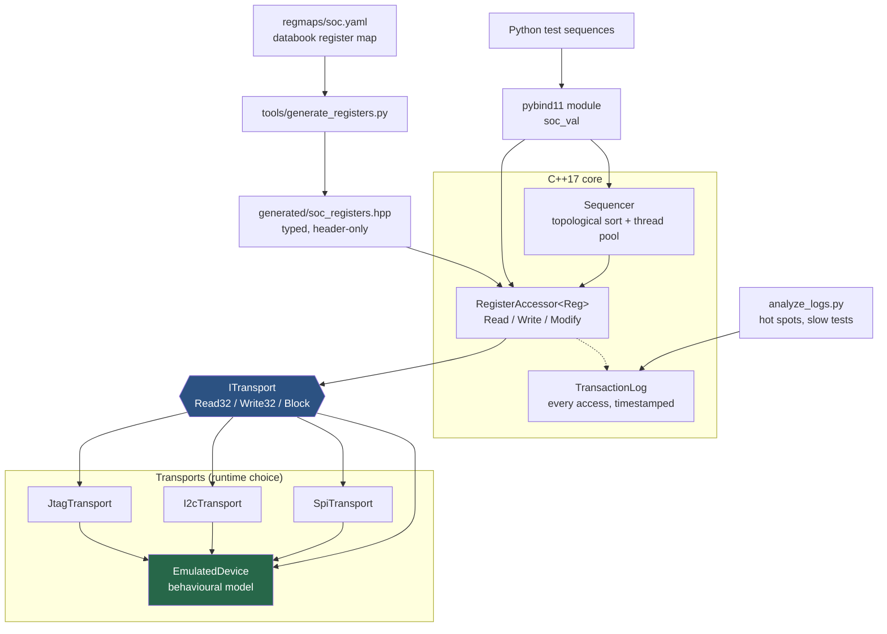

# soc-validation-framework

Post-silicon SoC validation framework. Register maps live in YAML, a generator turns them into a typed C++17 access layer, a pluggable transport talks to the device, and a dependency-aware sequencer runs the suite in parallel. Python bindings on top so a bring-up sequence is a few lines.

Builds and runs on Linux with no hardware attached.

---

## Architecture



---

## How YAML becomes C++

The databook says:

```yaml
- name: CTRL
  offset: 0x00
  reset: 0x00000000
  access: RW
  fields:
    - { name: GO,        bits: "0",    access: RW }
    - { name: BURST_LEN, bits: "11:4", access: RW }
- name: STATUS
  offset: 0x04
  reset: 0x00000001
  access: RO
  fields:
    - { name: DONE,      bits: "2",    access: RO }
- name: IRQ_STATUS
  offset: 0x08
  fields:
    - { name: DONE_IRQ,  bits: "0",    access: W1C }
```

`tools/generate_registers.py` emits:

```cpp
struct DMA_CTRL {
  static constexpr uint64_t kAddress = 0x40000000ull;
  static constexpr uint32_t kReset   = 0x00000000u;
  static constexpr Access   kAccess  = Access::RW;
  uint32_t raw{kReset};

  [[nodiscard]] constexpr uint32_t GO() const noexcept { return (raw & 0x00000001u) >> 0; }
  constexpr auto& set_GO(uint32_t v) noexcept {
    raw = (raw & ~0x00000001u) | ((v << 0) & 0x00000001u); return *this;
  }
  [[nodiscard]] constexpr uint32_t BURST_LEN() const noexcept { return (raw & 0x00000FF0u) >> 4; }
  constexpr auto& set_BURST_LEN(uint32_t v) noexcept { /* ... */ }
};

struct DMA_STATUS {              // access: RO
  [[nodiscard]] constexpr uint32_t DONE() const noexcept { ... }
  // no set_DONE - writing a read-only field does not compile
};

struct DMA_IRQ_STATUS {
  [[nodiscard]] constexpr uint32_t DONE_IRQ() const noexcept { ... }
  constexpr auto& clear_DONE_IRQ() noexcept { raw |= 0x1u; return *this; }  // W1C
  // no set_DONE_IRQ - see below
};
```

**The access policy lives in the type surface, not in a comment.** An RO field has no setter, so writing it is a compile error, not a code review catch. A W1C field offers only `clear_X()`, because `set_X(0)` is the mistake — writing 0 to a write-1-to-clear bit does nothing, and code that looks like it disables an interrupt silently does not.

Usage:

```cpp
auto transport = soc::MakeTransport("jtag");          // or "emulated" in CI
soc::RegisterAccessor<soc::regs::DMA_CTRL> ctrl(*transport);

ctrl.WriteOnly([](auto& r) { r.set_GO(1).set_BURST_LEN(8).set_CHANNEL(2); });

const auto status = soc::RegisterAccessor<soc::regs::DMA_STATUS>(*transport).Read();
if (status.DONE() && !status.BUSY()) { /* one bus read, four fields decoded */ }
```

The generated header is a **build artefact and is not committed** — otherwise someone edits the header and the databook and the code quietly disagree.

---

## Two things worth understanding before reading the code

### W1C — write 1 to clear

A W1C bit is a status latch. Hardware sets it; software clears it by **writing a 1** to that position. Writing 0 leaves it alone.

That inversion exists so two agents can clear different bits in the same register without a read: each writes a word with 1s only in the bits it owns, and every other bit — being 0 — is untouched. Without it, clearing one interrupt would require reading the register first, and whatever arrived between the read and the write would be destroyed.

### The read-modify-write race

```cpp
ctrl.Modify([](auto& r) { r.set_BURST_LEN(4); });   // Read, mutate, Write
```

Between the `Read` and the `Write` the **hardware** may change the register — a status bit latching, a counter advancing. The write puts the stale word back and that change is gone. Nothing in the code looks wrong.

It is at its worst on a register containing W1C bits. Read `IRQ_STATUS` with `DONE_IRQ` set, modify an unrelated bit, write it back — the written 1 in the `DONE_IRQ` position *clears the interrupt you never meant to touch*. A completion is lost by a helper that appeared to change one unrelated field.

Mitigations, in order:

1. use a dedicated set/clear register if the block has one — no read, no window;
2. `WriteOnly()` in this framework, which starts from the reset value instead of the device's current word, so untouched W1C bits are written as 0 and survive;
3. hold a lock that also excludes the interrupt handler;
4. narrow the window and re-verify after writing.

`tests/test_all.cpp::ReadModifyWriteOnAW1cRegisterLosesAnInterrupt` reproduces the loss deterministically and then shows `WriteOnly` avoiding it — the hazard is demonstrated, not asserted.

---

## Build and run

```bash
./scripts/setup.sh                 # deps (Debian/Ubuntu)
./scripts/build.sh                 # cmake + build
./scripts/run-suite.sh             # GoogleTest
./build/soc_benchmark              # rewrites benchmarks/RESULTS.md

./scripts/build.sh --compiler clang --sanitize address,undefined && ./build/soc_tests
./scripts/run-suite.sh --valgrind
./scripts/collect-artifacts.sh     # tarball for a bug report

./scripts/build.sh --python        # pybind11 module
PYTHONPATH=build python3 python/examples/dma_bringup.py
PYTHONPATH=build python3 python/analyze_logs.py 'artifacts/*.csv'
```

Requires CMake 3.20+, GCC 11+ or Clang 14+, GoogleTest, Python 3 with PyYAML.

---

## Measured results

From `./build/soc_benchmark` on a 12-thread machine. Full detail and method in [`benchmarks/RESULTS.md`](benchmarks/RESULTS.md), which the binary writes itself — no figure in it is hand-typed.

| | serial | parallel (12 threads) | |
|---|---:|---:|---:|
| 26-test suite wall time | 109.25 ms | 19.08 ms | **5.72x** |

| reading 4 fields of `DMA_STATUS` | naive | coalesced | |
|---|---:|---:|---:|
| bus transactions | 80,000 | 20,000 | **4.00x fewer** |
| simulated JTAG bus time | 320.00 ms | 80.00 ms | **4.00x** |

**Read these honestly.** The **transaction count** is the real result: exact, a property of the code rather than of this laptop, and on a physical JTAG link it is what sets runtime. The simulated bus time is that count times the cost model in `include/soc/transports.hpp` — arithmetic on a model, not a measurement of silicon. Host wall time against an in-process emulator is close to meaningless and is reported only so the gap is visible.

The defensible claim is *"4x fewer bus transactions for multi-field register reads, and 5.7x suite wall-clock from dependency-parallel execution"* — not a wall-clock speed-up on hardware that was never attached.

The parallel speed-up is below the thread count because the suite has two gating tests that must finish before the wide level starts. That shape is deliberate: it is what a real bring-up suite looks like.

---

## Adding a transport

1. Subclass `ProtocolTransport` with the protocol's cost, or `ITransport` directly if it does not fit the bit-time model:

```cpp
class UsbDebugTransport final : public ProtocolTransport {
 public:
  explicit UsbDebugTransport(std::unique_ptr<ITransport> backing)
      : ProtocolTransport(std::move(backing), {96, 480e6}, "usb") {}
};
```

2. Register it in `MakeTransport()` in `src/transports.cpp`.
3. Nothing else changes. Logging comes free via the `LoggedTransport` decorator, and every existing test runs against it unmodified — that is the point of selecting the transport at runtime from config: **the same test binary runs against emulation in CI and real silicon in the lab.**

---

## How this maps to real post-silicon bring-up

**First power-on, no software stack.** All you have is a debug port. The transport abstraction is exactly that situation: JTAG on day one, a faster link once the SoC boots enough to expose one, the same tests throughout.

**The databook is the contract, and it changes.** Late silicon respins move bits. When the map is source code, a moved field is a hand-edit in a dozen places and one of them gets missed. When it is YAML, it is a diff and a rebuild, and anything that no longer compiles is a bug the compiler found for you.

**Emulation before silicon, and after.** The behavioural model exists so tests are written and debugged before parts exist. Afterwards it is the reference: a test that passes in emulation and fails on the bench narrows the problem to the silicon or the setup, and the transaction logs from both runs diff directly. That is the artefact that turns "it failed" into a cycle-level story.

**Test time is bench time.** Post-silicon, the bottleneck is hours on a lab bench that other engineers are queuing for. Both benchmarks target that: fewer bus transactions per test, and independent tests overlapping instead of running in the order someone happened to write them.

**Failures must be reproducible.** Timeouts, structured results, per-test bus-access counts and a replayable transaction log all exist so a failure at 2am is diagnosable at 9am.

---

## Layout

```
regmaps/soc.yaml              databook register map (DMA + PCIe link status)
tools/generate_registers.py   YAML -> header-only C++17
include/soc/
  transport.hpp               ITransport, TransportError, MappedRegion (rule of five)
  register.hpp                RegisterAccessor: Read / Write / Modify / WriteOnly
  transports.hpp              JTAG / I2C / SPI cost models
  emulated_device.hpp         behavioural model: reset, RO, W1C, latency
  sequencer.hpp               dependency-sorted parallel execution
  txn_log.hpp                 transaction log + LoggedTransport decorator
tests/test_all.cpp            33 GoogleTest cases
benchmarks/bench_main.cpp     writes RESULTS.md from its own measurements
python/                       pybind11 bindings, example sequence, log analysis
scripts/                      setup / build / run-suite / collect-artifacts
```

## Memory management

The JD asks for real pointer and memory work, so it is deliberate and visible:

- `MappedRegion` owns a `new[]` buffer, deletes it in the destructor, deletes copy, implements move construction and self-safe move assignment, and frees the allocation if the constructor's fill throws part way through.
- `DeviceHandle` owns its transport through `unique_ptr` and rejects null at construction.
- The block API takes a raw `uint32_t*` and a count, because a bus read into a caller's buffer is one of the few places where a non-owning raw pointer is the honest type. It never allocates or frees.
- There are no raw owning pointers anywhere else.

Verified in CI under AddressSanitizer, UndefinedBehaviorSanitizer and Valgrind memcheck — all clean.
